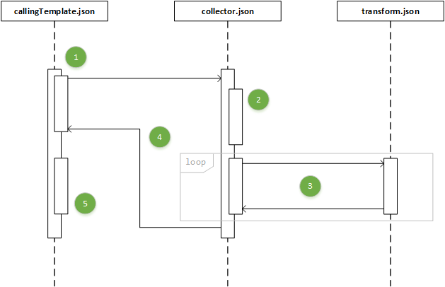

# ARM Property Transformer and Collector template

Some time ago I came across this article [Implement a property transformer and collector in an Azure Resource Manager template](https://docs.microsoft.com/en-us/azure/architecture/building-blocks/extending-templates/collector). While I could read and understand the purpose of this template, I always though that it could be better explained. And that is what I’m trying to do here. In the formerly linked article, there are two comments with people writing their own versions of this template, but I still believe it could be better demonstrated how this template works.

## Before we begin…

I have refactored the code published by the Patterns and Practices team (published under https://github.com/mspnp/template-examples/tree/master/example4-collector). The changes include:

1. Moved the collector.json and transform.json templates to a ‘nested’ folder. Mainly to comply with ARM quick start templates practices.
2. Renamed the main temaplate and it’s parameters file from deploy.json and deploy.parameters.json to callingTemplate.json and callingTemplate.json respectively to align them to the documentation.
3. Parametrized the Network Security Name property.

I made these changes because I believe they make the template more readable and help to the understanding of it. You can find my version on: https://github.com/hjlarrea/ARMTransformerCollector. You can deploy my version by following any of these two examples:

**Using azcli:**

```bash
cd ARMTransformerCollector
az group create --location eastus --name testDeployment
az group deployment create -g testDeployment --template-uri https://raw.githubusercontent.com/hjlarrea/ARMTransformerCollector/master/callingTemplate.json --parameters callingTemplate.parameters.json
```

**Using PowerShell:**

```powershell
git clone https://github.com/hjlarrea/ARMTransformerCollector.git
cd ARMTransformerCollector
New-AzureRmResourceGroup -Name testDeployment -Location eastus
New-AzureRmResourceGroupDeployment -ResourceGroupName testDeployment -TemplateParameterFile .\callingTemplate.parameters.json -TemplateUri https://raw.githubusercontent.com/hjlarrea/ARMTransformerCollector/master/callingTemplate.json
```

## How does it work?

An easy way approach this pattern and to understand the effect of running this template is to deploy it. And then look at the inputs of the ‘collector’ deployment and outputs of the last loop executed as part of the ‘collector’ deployment.

Input of ‘collector’ deployment, ‘source’ parameter:

```json
[
    {
        "name": "RDPAllow",
        "description": "allow RDP connections",
        "direction": "Inbound",
        "priority": 100,
        "sourceAddressPrefix": "*",
        "destinationAddressPrefix": "10.0.0.0/24",
        "sourcePortRange": "*",
        "destinationPortRange": "3389",
        "access": "Allow",
        "protocol": "Tcp"
    },
    {
        "name": "HTTPAllow",
        "description": "allow HTTP connections",
        "direction": "Inbound",
        "priority": 200,
        "sourceAddressPrefix": "*",
        "destinationAddressPrefix": "10.0.1.0/24",
        "sourcePortRange": "*",
        "destinationPortRange": "80",
        "access": "Allow",
        "protocol": "Tcp"
    }
]
```

So as you can see, what the linked template (collector) is being provided is an array with 2 objects, each of these with a set if properties all arranged at the same level. Then, if you check the output of the last loop (this is the content of the `[reference(‘collector’).outputs.result.value]` clause used in the callingTemplate.json), you’ll see how these values are rearranged in two levels (name is kept at the root, but the rest is nested under a property called ‘properties’):

```json
[
    {
        "name": "RDPAllow",
        "properties": {
            "description": "allow RDP connections",
            "protocol": "Tcp",
            "sourcePortRange": "*",
            "destinationPortRange": "3389",
            "sourceAddressPrefix": "*",
            "destinationAddressPrefix": "10.0.0.0/24",
            "access": "Allow",
            "priority": 100,
            "direction": "Inbound"
        }
    },
    {
        "name": "HTTPAllow",
        "properties": {
            "description": "allow HTTP connections",
            "protocol": "Tcp",
            "sourcePortRange": "*",
            "destinationPortRange": "80",
            "sourceAddressPrefix": "*",
            "destinationAddressPrefix": "10.0.1.0/24",
            "access": "Allow",
            "priority": 200,
            "direction": "Inbound"
        }
    }
]
```

So as you can see the idea is to transform the original content of the parameter networkSecurityGroupsSettings into something that can be understood by a deployment of Microsoft.Network/networkSecurityGroups type (see [SecurityRule object](https://docs.microsoft.com/en-us/azure/templates/microsoft.network/2018-08-01/networksecuritygroups#securityrule-object)). But, how does this transformation happen?

## Digging deeper into the template

Now that we have seen how the input is transformed, let see how this template works under the hood. The easiest way I found to demonstrate this, is using an interaction / sequence diagram.




1. callingTemplate,json makes a deployment of a linked template, referring to collector.json. The deployment is named **collector** and the parameter **source** is provided with the content of the **networkSecuritySettings** parameter of the callingTemplate.json. *(Take notice as the content of the **networkSecuritySettings** parameter, as it does contain 1 object called **securityRules** which contains an array of 2 objects. It is the array of items that is provided to the collector.json template, not the object itself. When the collector.json is invoked, the **source** parameter is initialized using `[parameters(‘networkSecurityGroupsSettings’).securityRules]`, sending the array inside 
**securityRules** not the **securityRules** object.)*
2. collector.json is invoked. The **state** parameter is initialized with an empty array, as it is it’s default value. It first deploys a nested template. This deployment is named **loop-0**. The only thing this deployment does is to provide as output the content of the **state** (which remains an empty array).
3. Then a second deployment part of the collector.json is a linked template (transform.json). This deployment is inside a copy loop, that will iterate for each of the objects passed to the **source** parameter of collection.json (see step 1). Each of the iterations is named **loop-#**, where **#** is the iteration number + 1. This is done  by using the **copyindex(1)** clause. **Copyindex** will provide will provide the iteration number, starting from 0, but as the offset is set to 1 and we have 2 objects as members of the **source** parameter, the deployments product of this copy loop will be called **loop-1** and **loop-2**. The reason for doing this, is because with every execution of the transform.json template, you want to collect the result of the previous execution, that’s why you need a **loop-0** deployment that the only thing it does is to return an empty array (see step 2). This is achieved by passing the transform.json template’s **state** paramter the value of the previous loop `[reference(concat(‘loop-‘, copyindex())).outputs.collection.value]`. Notice that in this case the copyindex clause is used without any offset, so it refers to previous deployments named **loop-#**. Inside the transofrm.json nothing remarkable happens, only the values that arrive to the **source** parameter (on instance of the **securityRules** object from step 1 at a time) is rearranged into the form we want to obtain, and concatenated to whatever arrived to the **state** parameter.
4. The collector.json file provides as ouput the content of the **collection** output from the last execution of the transform.json.
5. The callingTemplate.json deploys a network security group, and uses for the **securityRules** property, the output of the collector.json (output named **result**).

## When would it be appropriate to implement this pattern?

There are a few scenarios where implementing this pattern might become useful, but I think the most useful one is when you need to deploy several instances of a component which ARM structure or definition is complex, so it can be defined as a plain object and then properly formed during run time. As Microsoft says:

>(It is possible) to store resource property values in an object and apply them to a resource during deployment. While this is a very useful way to manage your parameters, it still requires you to map the object’s properties to resource properties each time you use it in your template.
>To work around this, you can implement a property transform and collector template that iterates your object array and transforms it into the JSON schema expected by the resource.

Hernán J. Larrea