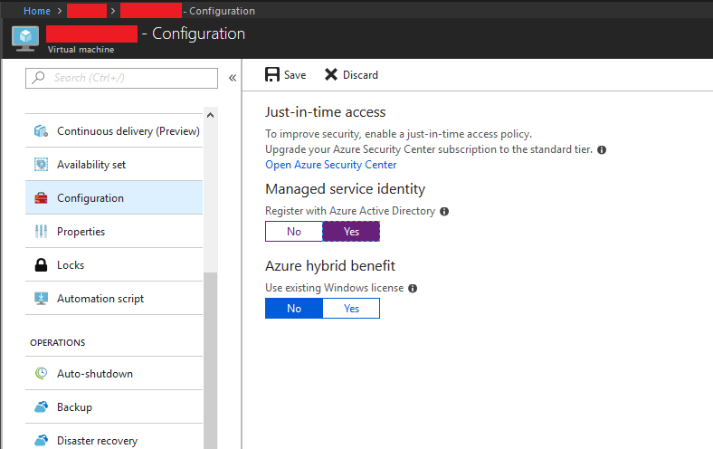

# Azure AD Managed Service Identities

On the last few weeks I've been reading, watching some videos and even attending some Microsoft sessions on Managed Service Identities, so I thought it was time to give it a try. In summary, Azure AD MSI is a way to give an identity in Azure AD to an Azure resource, allowing you grant this resource MSI enabled to other azure resources.

Before going into much details, I'll let you watch this video:

<iframe width="560" height="315" src="https://www.youtube.com/embed/bBi1bll2928" frameborder="0" allow="accelerometer; autoplay; encrypted-media; gyroscope; picture-in-picture" allowfullscreen></iframe>

Some other must read articles are the following, published in the Kloud by John Downs, Demystifying Managed Service Identities on Azure. From Microsoft Docs, [What is Managed Service Identity for Azure resources?](https://docs.microsoft.com/en-us/azure/active-directory/managed-service-identity/overview). And [Azure AD Managed Service Identity updates](https://azure.microsoft.com/en-us/blog/azure-ad-managed-service-identity-updates/).

So, how did things look before MSI? Let's consider this example, I have a VM running in Azure, and I want to retrieve a Secret from a Key Vault. In order to do so I need to (considering the SPN is already created and the proper rights given at the AKV level):

1. Get a Token to interact with the KeyVault API by providing my SPN details.
2. Use the obtained token to retrieve my secret.

I'll use PowerShell as it is what I feel more comfortable with, but this mechanics should apply to any other language (unless you have a framework that resolves most of this for you, but still you'll need somehow to provide yout SPN details). First, we need to obtain a token from AAD:

```powershell
$Body = @{
    'client_id' = "REPLACEME" #Your SPN Application (or Client) ID
    'client_secret' = "REPLACEME" #Your SPN Secret (or key)
    'grant_type' = 'client_credentials'
    'resource'= "https://vault.azure.net"
}
 
$TenantID = "REPLACEME" #Your tenant ID in Azure AD
$TokenEndpoint = "https://login.windows.net/$TenantID/oauth2/token"
$ContentType = 'application/x-www-form-urlencoded'
$Header = @{'accept'='application/json'}
 
#Call to the REST API to get the token
$requestResult = Invoke-RestMethod -Method Post -Uri $TokenEndpoint -Body $Body -Headers $Header -ContentType $ContentType
 
#Filter out the token from the invokation response
$token=$requestResult | Select-Object -ExpandProperty access_token
```

Once you have the token, you can now retrieve your secret from your AKV:

```powershell
$Header=@{"Authorization"="Bearer $token"}
$URI="https://YOURKEYVAULTNAME.vault.azure.net/secrets/YOURSECRETNAME/YOURSECRETVERSION?api-version=2016-10-01"
$response=Invoke-RestMethod -Method Get -Uri $URI -Headers $Header -ContentType "application/json"
```

This is not that difficult, but if you are a developer, it means you need to maintain the SPN details inside your application and deal with it's key's expiration. MSI is here to save you from that.

# Let's try MSI

First thing I'll need to do, is to go into the Azure Portal, and enable MSI for my newly built VM (you'll find this under the Configuration section):



Once the operation completes, go to the resource you want to grant access from this VM to (in this case, my Azure Key Vault), and provide the appropriate level of access to the SPN generated based on the type of operations you will use it for (Read, Write, etc.).

After completing this, you should be ready to go. The steps remain the same, first, we need to obtain a token. The only difference is that we don't go to AAD, instead we have an IMDS (Instance Meta Data Service) end point that will provide us with a token:

```powershell
$response = Invoke-WebRequest -Uri 'http://169.254.169.254/metadata/identity/oauth2/token?api-version=2018-02-01&resource=https%3A%2F2Fvault.azure.net' -Method GET -Headers @{Metadata="true"}
$token=($response.content | convertfrom-json).access_token
```

(Take a note in the IMDS URL we are using to request the token, we are specifying the resource we want that token for: 'http://169.254.169.254/metadata/identity/oauth2/token?api-version=2018-02-01&resource=https%3A%2F2Fvault.azure.net'.)

Finally, once you have obtained the token, you just repeat the same query we have used before to obtain the Secret:

```powershell
$Header=@{"Authorization"="Bearer $token"}
$URI="https://YOURKEYVAULTNAME.vault.azure.net/secrets/YOURSECRETNAME/YOURSECRETVERSION?api-version=2016-10-01"
$response=Invoke-RestMethod -Method Get -Uri $URI -Headers $Header -ContentType "application/json"
```

As you can see, this is even simpler than before, saving you from having to deal with the credentials (SPN) maintainance as part of your solution. Easy, simple and effective. But Microsoft is not stopping here, and new features will be release soon for MSI.

This we have tried is System Assigned MSI, soon Microsoft will be releasing to Public Preview a new feature User Assigned MSIs. The difference between these two is the following. In User Assigned Identities, instead of assigning an identity to a resource, the Identity is a resource itself, which later is associated with another resource. In other words, instead enabling MSI for a VM, you will generate an MSI resource, and then pair it with a VM.

This means that possibly (and I say possibly because this is yet to be confirmed) you'll be able to:

1. Assign multiple MSIs to a single resource, this gives you the possibility of assigning different SPNs, whith different level of access to different resources, which adds to security.

2. Assign a single MSI to multiple resources, I'm not a huge fan of this one, as it kinda violates the principle of accountability, but it adds to the flexibility that MSI provides.

This might add a little bit more of complexity, as if you have more than one MSI assigned to a resource, when you call the IMDS, you'll not just need to tell for which resource you want it, but also for which of all your assigned SPNs you want it, which in other words, it means that you'll need to know which MSIs the resource where your code is running has been assigned, and which you can use to access what. But from the bright side, it still saves you from the burden of managing service accounts and password expirations.

Even if this feature is still to be release to preview, there is already documentation uploaded to https://docs.microsoft.com and the PowerShell module is on preview on [PowerShell Gallery](https://www.powershellgallery.com/packages/AzureRM.ManagedServiceIdentity/1.0.0-preview).