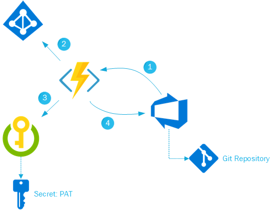

# Use Azure Functions to enforce Pull Request Reviewers in Azure DevOps

I'm currently working on a project that requires several engineers creating and updating multiple Git repositories within the same project in Azure DevOps. To ensure that all the code uploaded to these repositories and merged to their master branch follows the team standards, I wanted to create a Branch Policy for all repositories (the existing ones, and the ones which don't exist yet) that enforced an Azure DevOps Team as reviewer for every Pull Request. While doing some research I found a Microsoft document which proposed using Azure Functions to create custom branch policies, unfortunately this didn't cover exactly what I needed (still, I do recommend reading this document as it will cover the basics on creating a Function App and how to register the Service Hook in Azure DevOps, and I'll not be covering those details here). But even so, it certainly was a good starting point.

After giving some through to it, it was clear to me that, besides the Function App I also needed an Azure Key Vault to store some information (such as the PAT for interacting with Azure DevOps). And in order to be able to retrieve the Secrets that I was planning to store in the Azure Key Vault, I needed some form of authentication / authorization against the Azure Key Vault API. In summary, my process should look like this:



1. A Pull Request is submitted, Azure DevOps invokes the Function App via the Service Hook
2. The Function app requests a token to Azure AD by using the Managed Service Identity (for authenticating against Azure AD) assigned to the Function App. (Follow this link if you want to read more about [Managed Service Identities](http://www.hernanjlarrea.com/index.php/azure-ad-managed-service-identities/)).
3. The Function App connects to the Azure Key Vault and retrieves the Secret containing the PAT.
4. The Function App connects back to Azure DevOps and performs the programmed functionality.

In order for all these resources to talk between each other, there are a few tasks you'll need to accomplish (I won't cover in detail what each of these imply as they are rather basic and you'll find plenty of posts online explaining how to do it if you don't know it already).

- Enable Managed Service Identity for you Function App
- Allow the SPN generated for the Function App access to the Azure Key Vault Secrets by adding a policy in the AKV
- Create a PAT in Azure DevOps and store it as a Secret in the AKV

Once you have deployed and connected all the components, the customization left to be done is quite simple.

First of all, you'll need, 2 Application Settings to be registered in your Function App:

- **secretURI**: this is the URI to the secret stored in your Azure Key Vault.
- **reviewerId**: here I've stored the ID of the object (a group in my case) that I want to enforce to every Pull Request. In order to understand how to obtain this information please refer to https://docs.microsoft.com/en-us/rest/api/vsts/core/teams/get%20all%20teams?view=vsts-rest-4.1 (TIP: as this is a simple GET, you can paste the URI on a tab of a browser that's already validated against your Azure DevOps Organization).

After that is done, in your Azure Function, you'll need a 'function.proj' file which contains the following references to the NuGet packages used to interact with Azure AD and Azure Key Vault:

```xml
<ItemGroup>
    <PackageReference Include="Microsoft.NET.Sdk.Functions" Version="1.0.22" />
    <PackageReference Include="Microsoft.Azure.KeyVault" Version="3.0.0" />
    <PackageReference Include="Microsoft.Azure.Services.AppAuthentication" Version="1.0.3" />
    <PackageReference Include="Microsoft.Rest.ClientRuntime.Azure" Version="3.3.16" />
</ItemGroup>
```

And finally your 'run.csx' file should look like this:

```cs
#r "Newtonsoft.Json"
 
using System;
using System.Net;
using System.Net.Http;
using System.Net.Http.Headers;
using System.Text;
using Newtonsoft.Json;
using System.Configuration;
using Microsoft.Azure.Services.AppAuthentication;
using Microsoft.Azure.KeyVault;
using Microsoft.Azure.KeyVault.Models;
using Microsoft.IdentityModel.Clients.ActiveDirectory;
 
public static async Task<HttpResponseMessage> Run(HttpRequestMessage req, TraceWriter log)
{
    try
    {
        log.Info("Service Hook Received.");
 
        // Get request body
        dynamic data = await req.Content.ReadAsAsync<object>();
 
        log.Info("Data Received: " + data.ToString());
 
        // Get the pull request object from the service hooks payload
        dynamic jObject = JsonConvert.DeserializeObject(data.ToString());
 
        // Get the pull request id
        int pullRequestId;
        if (!Int32.TryParse(jObject.resource.pullRequestId.ToString(), out pullRequestId))
        {
            log.Info("Failed to parse the pull request id from the service hooks payload.");
        };
 
        // Get the pull request title
        string pullRequestTitle = jObject.resource.title;
        // Get the account name
        string accountName = jObject.resourceContainers.account.baseUrl.ToString().Split(".")[0].Split("//")[1];
        //Get the repository id
        string repositoryId = jObject.resource.repository.id.ToString();;
 
        log.Info("Service Hook Received for PR: " + pullRequestId + " " + pullRequestTitle);
 
        
        SecretBundle secret;
        //Retrieve the Secret URI from the Application Settings
        string secretURI = System.Environment.GetEnvironmentVariable("secretURI");
        var serviceTokenProvider = new AzureServiceTokenProvider();
        var keyVaultClient = new KeyVaultClient(new KeyVaultClient.AuthenticationCallback(serviceTokenProvider.KeyVaultTokenCallback));  
        secret = await keyVaultClient.GetSecretAsync(secretURI);
 
        //Retrieve Reviewer ID from the Application Settings
        string reviewerId = System.Environment.GetEnvironmentVariable("reviewerId");
 
        PutReviewersOnPullRequest(pullRequestId, accountName, repositoryId, secret.Value, reviewerId);
 
        return req.CreateResponse(HttpStatusCode.OK);
    }
    catch (Exception ex)
    {
        log.Info(ex.ToString());
        return req.CreateResponse(HttpStatusCode.InternalServerError);
    }
}
 
private static void PutReviewersOnPullRequest(int pullRequestId, string accountName, string repositoryId, string pat, string reviewerId)
{
    //Form the URI to the Pull Request
    string Url = string.Format(
        @"https://dev.azure.com/{0}/_apis/git/repositories/{1}/pullRequests/{2}/reviewers/{3}?api-version=4.1",
        accountName,
        repositoryId,
        pullRequestId,
        reviewerId);
    
    //Generate the payload for the API call
    string payload = JsonConvert.SerializeObject(
        new
        {        
            vote = 0
        });
 
    //Invoke the Azure DevOps API
    using (HttpClient client = new HttpClient())
    {        
        client.DefaultRequestHeaders.Accept.Add(new MediaTypeWithQualityHeaderValue("application/json"));
        client.DefaultRequestHeaders.Authorization = new AuthenticationHeaderValue("Basic", Convert.ToBase64String(
                ASCIIEncoding.ASCII.GetBytes(
                string.Format("{0}:{1}", "", pat))));
 
        var method = new HttpMethod("PUT");
        var request = new HttpRequestMessage(method, Url)
        {
            Content = new StringContent(payload, Encoding.UTF8, "application/json")
        };
 
        using (HttpResponseMessage response = client.SendAsync(request).Result)
        {
            response.EnsureSuccessStatusCode();
        }
    }
}
```

Hernán J. Larrea