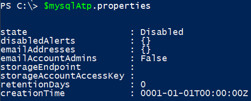
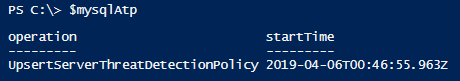
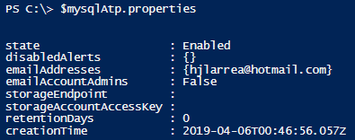

# Enabling Advanced Threat Protection for Azure Database for MySQL programmatically

As you might have seen in previous posts, I’ve been playing around a lot with Azure Database for MySQL. On September last year, Microsoft announced Advanced Threat Protection for MySQL was in preview. Recently I needed to automate the deployment of this component and wanted to enable ATP on deployment time with no manual intervention. To my surprise the feature cannot be enabled via Azure Cli nor ARM templates. But it is possible to enable it using the Resource Manager REST API.

The alternative to the Portal, to enable this programmatically, you can use the Azure RM REST API, as it is documented here: [Server Security Alert Policies](https://docs.microsoft.com/en-us/rest/api/mysql/serversecurityalertpolicies).

In order to accomplish this, what you’ll need is a token for the management.azure.com API. You can do this by authenticating against login.microsoftonline.com and asking for a token to interact with the Azure RM API (approach when you want to automate the process). If you are interested on checking how to do this, follow [this article](https://blogs.technet.microsoft.com/stefan_stranger/2016/10/21/using-the-azure-arm-rest-apin-get-access-token/). Keep in mind it is an old article, the add “required permissions” steps to grant permissions to the SPN to interact with Service Manager can be ignored.

Alternatively, you can connect to Azure RM with your user account (either using PowerShell AzureRM modules or Azure Cli). I’ll follow this second last approach as it is simpler to demonstrate. You can obtain a token by running these commands:

```powershell
#Login to Azure
Login-AzureRMAccount
#Retrieve the token
$token = (Get-AzureRMContext).TokenCache.ReadItems().AccessToken
```

Once you have obtained the token, you can query the status of Advanced Threat Protection by running:

```powershell
$mysqlAtp = Invoke-RestMethod -Method GET -Uri https://management.azure.com/subscriptions/{subscriptionId}/resourceGroups/{resourceGroupName}/providers/Microsoft.DBforMySQL/servers/{mySQLServerName}/securityAlertPolicies/Default?api-version=2017-12-01 -Headers @{ "Authorization" = "Bearer $($token.AccessToken)" }
```
**Replace {subscriptionId}, {resourceGroupName} and {mySQLServerName} with the corresponding values for your case.*

The result will look like this:



To enable it, you will have to run:

```powershell
$body = New-Object -TypeName PSCustomObject
$body | Add-Member -MemberType NoteProperty -Name properties -Value (New-Object -TypeName PSCustomObject)
$body.properties | Add-Member -MemberType NoteProperty -Name "State" -Value "Enabled"
$body.properties | Add-Member -MemberType NoteProperty -Name "emailAddresses" -Value @("hjlarrea@hotmail.com")

$mysqlAtp = Invoke-RestMethod -Method PUT -Uri "https://management.azure.com/subscriptions/{subscriptionId}/resourceGroups/{resourceGroupName}/providers/Microsoft.DBforMySQL/servers/{mySQLServerName}/securityAlertPolicies/Default?api-version=2017-12-01" -Headers @{ "Authorization" = "Bearer $token" } -Body $($body | ConvertTo-Json) -ContentType "application/json"
```
The answer should look like this:



And if you run again the first step to check how the ATP policy is configured, you should obtain the following:



The full script to enable Advanced Threat Protection should look like this:

```powershell
#Login to Azure
Login-AzAccount

#Initialize variables
$token = (Get-AzContext).TokenCache.ReadItems()[1].AccessToken
$subscriptionId = "subscriptionId"
$resourceGroupName = "resourceGroupName"
$mySQLServer = "mySQLServer"
$uri = "https://management.azure.com/subscriptions/{0}/resourceGroups/{1}/providers/Microsoft.DBforMySQL/servers/{2}/securityAlertPolicies/Default?api-version=2017-12-01" -f $subscriptionId,$resourceGroupName,$mySQLServer

#Get current configuration for ATP
$mysqlAtp = Invoke-RestMethod -Method GET -Uri $uri -Headers @{ "Authorization" = "Bearer $token" }
Write-Output "Current configuration:"
Write-Output $mysqlAtp.properties

#Set Body for the ATP configuration request
$body = New-Object -TypeName PSCustomObject
$body | Add-Member -MemberType NoteProperty -Name properties -Value (New-Object -TypeName PSCustomObject)
$body.properties | Add-Member -MemberType NoteProperty -Name "State" -Value "Enabled"
$body.properties | Add-Member -MemberType NoteProperty -Name "emailAddresses" -Value @("hjlarrea@hotmail.com")

#ATP configuration request
$mysqlAtp = Invoke-RestMethod -Method PUT -Uri $uri -Headers @{ "Authorization" = "Bearer $token" } -Body $($body | ConvertTo-Json) -ContentType "application/json"

#Get current configuration for ATP
$mysqlAtp = Invoke-RestMethod -Method GET -Uri $uri -Headers @{ "Authorization" = "Bearer $token" }
Write-Output "Current configuration:"
Write-Output $mysqlAtp.properties
```